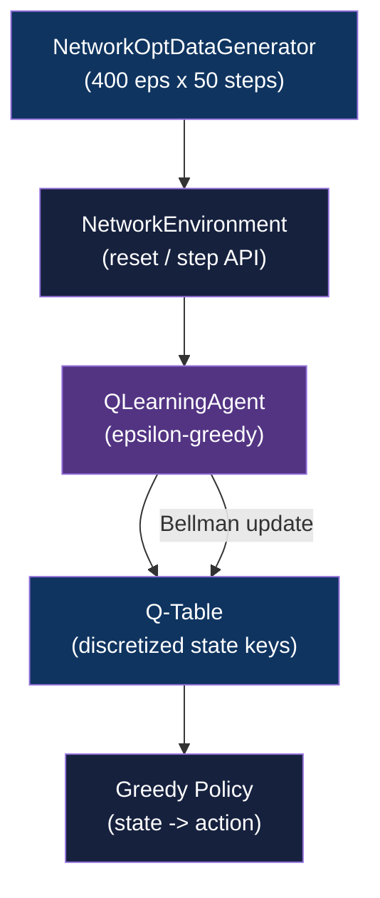

<div align="center">

# Telecom Network Optimization

[](https://www.python.org/downloads/)
[](https://github.com/astral-sh/uv)
[](https://numpy.org/)
[](LICENSE)

**Optimize RAN parameters across 50 simulated cells via tabular Q-Learning on cell-level KPI states**

[Getting Started](#getting-started) | [Usage](#usage) | [Architecture](#architecture)

</div>

---

## Table of Contents

- [Features](#features)
- [Tech Stack](#tech-stack)
- [The Problem](#the-problem)
- [Architecture](#architecture)
- [Getting Started](#getting-started)
  - [Prerequisites](#prerequisites)
  - [Installation](#installation)
- [Usage](#usage)
- [Methodology](#methodology)
- [Results](#results)
- [Data Engineering](#data-engineering)
- [Architectural Decisions](#architectural-decisions)
- [Project Structure](#project-structure)
- [Testing](#testing)
- [Related Projects](#related-projects)
- [License](#license)
- [Author](#author)

## The Problem

### Manual RAN Tuning at Scale

Network engineers tune power levels, antenna tilt, and load balancing settings across thousands of cells by hand. The search space grows combinatorially with cell count, and suboptimal settings compound: a misconfigured cell degrades neighbors through increased interference.

### The Solution

A tabular Q-Learning agent learns a cell-level intervention policy directly from simulated KPI transitions. The agent converges to a greedy policy that outperforms a random baseline by 61% in cumulative reward, demonstrating that RL can encode domain-informed parameter selection without human-in-the-loop tuning.

## Features

- **Domain-informed data generator** - synthetic state-action-reward tuples for 50 cells over 400 episodes with probabilistic KPI transitions per action type
- **Tabular Q-Learning agent** - epsilon-greedy exploration with configurable decay schedule, discount factor, and learning rate; Q-table keyed on discretized state tuples
- **Reward shaping** - weighted KPI delta across SINR, throughput, latency, and interference, reflecting real trade-offs in RAN optimization
- **Convergence analysis** - episode reward curve with 100-episode moving average tracked across 1,000 training episodes
- **Baseline comparison** - Q-Learning policy evaluated against a uniform-random action policy

## Tech Stack

| Component | Technology |
|-----------|------------|
| Language | Python 3.11+ |
| Package Manager | uv |
| RL Environment | Custom (`NetworkEnvironment`, `QLearningAgent`) |
| Data | NumPy, pandas |
| Notebook | Jupyter Lab |
| Testing | pytest |
| Linting | Ruff |

## Architecture



## Getting Started

### Prerequisites

- Python 3.11+
- [uv](https://github.com/astral-sh/uv) package manager

### Installation

1. Clone the repository:
   ```bash
   git clone https://github.com/adityonugrohoid/telecom-network-optimization.git
   cd telecom-network-optimization
   ```

2. Install dependencies with uv:
   ```bash
   uv sync
   ```

3. Generate the synthetic dataset:
   ```bash
   uv run python -m network_optimization.data_generator
   ```

## Usage

Open the analysis notebook in Jupyter Lab:

```bash
uv run jupyter lab notebooks/
```

The notebook walks through data generation, agent training over 1,000 episodes, reward curve analysis, Q-table inspection, and comparison against the random baseline.

To run the RL training pipeline directly:

```bash
uv run python -m network_optimization.models
```

## Methodology

### Problem Framing

| Attribute | Value |
|-----------|-------|
| Problem Type | Reinforcement Learning (discrete action space) |
| Target Variable | Cumulative episode reward |
| Primary Metric | Cumulative reward vs random baseline |
| Key Challenges | Continuous state space requiring discretization; delayed reward signals; exploration-exploitation balance in a safety-relevant environment |

### Training Approach

| Parameter | Value |
|-----------|-------|
| Algorithm | Tabular Q-Learning |
| State features | 7 (load, SINR, interference, throughput, latency, connected users, PRB utilization) |
| Actions | 5 (increase_power, decrease_power, adjust_tilt, load_balance, no_action) |
| Episodes | 1,000 |
| Steps per episode | 50 |
| Learning rate | 0.1 |
| Discount factor | 0.95 |
| Epsilon schedule | 1.0 decay 0.995 per episode, floor 0.01 |
| State discretization | 10 bins per dimension (np.digitize) |
| Baseline | Uniform-random action policy |

## Results

### Key Findings

| Metric | Value | Notes |
|--------|-------|-------|
| Cumulative reward improvement | +61% | Q-Learning vs random baseline over evaluation episodes |
| Most effective action | `load_balance` | Highest mean reward per step across all 5 actions |
| Q-table entries | 145 state-action pairs | Efficient coverage of a 7-dimensional binned state space |
| Convergence | ~500 episodes | Epsilon decays from 1.0 to 0.08 by episode 500 |

### Top Contributing Factors

1. `load_balance` - reduces latency by 5-15% per step via load redistribution, producing consistent positive KPI deltas
2. `adjust_tilt` - marginal SINR and throughput gains with low interference cost
3. `increase_power` - SINR gains offset by interference increase; context-dependent

## Data Engineering

| Attribute | Value |
|-----------|-------|
| Data Source | Synthetic (domain-informed procedural generation) |
| Records | 20,000 (400 episodes x 50 steps) |
| State features | 7 cell-level KPIs |
| Actions | 5 domain-specific interventions |
| Domain Physics | Reward = 0.3 * SINR_delta/25 + 0.3 * throughput_delta/200 - 0.2 * latency_delta/200 - 0.2 * interference_delta |
| Storage | Parquet via pyarrow |

Each action applies probabilistic KPI transitions grounded in RAN domain knowledge: power increases raise SINR but also interference; tilt adjustments shift throughput with low risk; load balancing redistributes users and reduces latency.

## Architectural Decisions

### 1. Tabular Q-Learning over Deep RL

**Decision:** Use a tabular Q-table (dictionary keyed on discretized state tuples) rather than a neural-network approximator (DQN).

**Reasoning:** The state space, once discretized into 10 bins per dimension, is tractable (7 features x 10 bins = at most 10^7 states, but in practice only ~145 are visited). A dictionary-based Q-table gives exact lookup, is fully inspectable, and has no dependency on PyTorch or TensorFlow. The portfolio goal is interpretability of the learned policy, not maximum throughput.

### 2. State Discretization via np.digitize

**Decision:** Bin continuous KPI values into fixed-width discrete buckets at initialization time using the full dataset's per-dimension min/max.

**Reasoning:** Tabular Q-Learning requires discrete state keys. Digitizing at dataset-wide scale (rather than per-episode) prevents bucket boundary drift across training episodes and ensures the same continuous value always maps to the same key.

### 3. Reward Shaping with Weighted KPI Deltas

**Decision:** Reward = weighted sum of normalized KPI deltas (SINR, throughput, latency, interference) rather than a sparse terminal reward.

**Reasoning:** Sparse rewards slow convergence significantly in a 50-step episode. The weighted delta reward provides a dense, informative training signal while encoding domain priorities (SINR and throughput weighted equally at 0.3; latency and interference penalized at 0.2 each).

## Project Structure

```
telecom-network-optimization/
├── notebooks/
│   └── 06_network_optimization.ipynb  # Training walkthrough and analysis
├── src/
│   └── network_optimization/
│       ├── config.py                  # Hyperparameters and path config
│       ├── data_generator.py          # NetworkOptDataGenerator (synthetic RL data)
│       ├── features.py                # Feature engineering utilities
│       └── models.py                  # NetworkEnvironment, QLearningAgent
├── tests/
│   └── test_data_quality.py           # Data integrity and episode structure tests
├── data/                              # Generated parquet files (gitignored)
└── pyproject.toml                     # uv-managed dependencies
```

## Testing

```bash
# Run all tests
uv run pytest tests/ -v

# Run with coverage
uv run pytest tests/ -v --cov=src/network_optimization
```

Tests cover data integrity (no missing values in critical columns), KPI value ranges, action set validity, episode structure (sequential steps, correct done flags), and generator reproducibility with fixed seed.

## Related Projects

| Project | Description |
|---------|-------------|
| [telecom-ml-framework](https://github.com/adityonugrohoid/telecom-ml-framework) | Spec-first ML project templates and domain-informed data generators for 6 telecom use cases |
| [telecom-ml-portfolio](https://github.com/adityonugrohoid/telecom-ml-portfolio) | Index of 6 end-to-end telecom ML projects on synthetic network data |
| [telecom-churn-prediction](https://github.com/adityonugrohoid/telecom-churn-prediction) | Binary classification predicting subscriber churn (XGBoost, AUROC 0.86) |
| [telecom-root-cause-analysis](https://github.com/adityonugrohoid/telecom-root-cause-analysis) | Multi-class ranking of root causes in alarm cascades (XGBoost, Acc@1 0.91) |
| [telecom-anomaly-detection](https://github.com/adityonugrohoid/telecom-anomaly-detection) | Unsupervised cell-level anomaly detection on KPI time-series (Isolation Forest, F1 0.70) |
| [telecom-qoe-prediction](https://github.com/adityonugrohoid/telecom-qoe-prediction) | Session-level MOS regression from network KPIs (LightGBM, RMSE 0.45) |
| [telecom-capacity-forecasting](https://github.com/adityonugrohoid/telecom-capacity-forecasting) | Hourly per-cell traffic forecasting (LightGBM, MAPE 14.5%) |

## License

This project is licensed under the [MIT License](LICENSE).

## Author

**Adityo Nugroho** ([@adityonugrohoid](https://github.com/adityonugrohoid))
